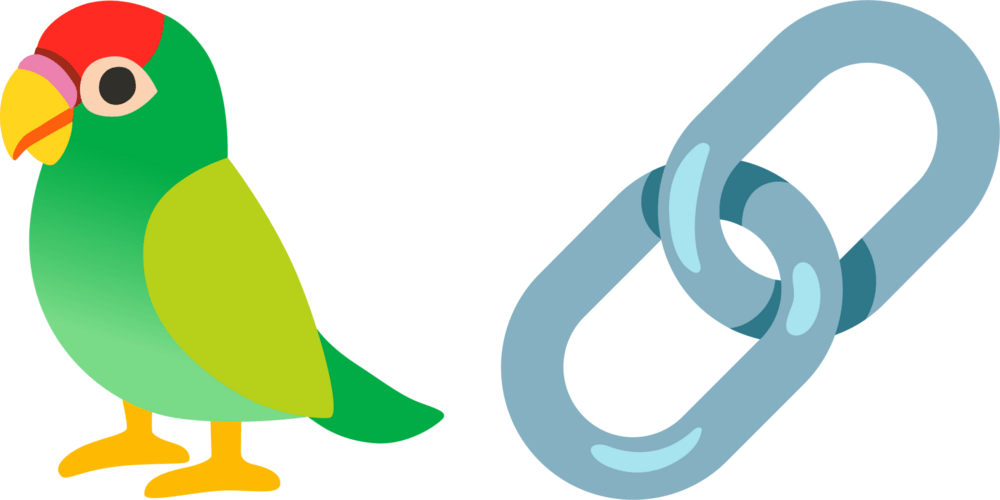

## &nbsp; Hey! Nice to see you.

  
## Key Areas of Expertise:
- **UGV Development**: Designing and implementing autonomous navigation, perception, and control systems for UGVs.
- **Robotics**: Developing robotic systems with advanced capabilities in areas like manipulation, navigation, and human-robot interaction.
- **Chatbot Development**: Building intelligent conversational agents powered by natural language processing and generation.
- **Generative AI**: Exploring the frontiers of AI-powered content creation, including text, image, and audio generation.

## Featured Projects:

- **UGV Navigation System**: Developed a robust navigation system for an autonomous UGV, integrating SLAM, path planning, and control algorithms.
- **Robotic Arm Controller**: Designed and implemented a control system for a multi-joint robotic arm, enabling precise manipulation of objects.
- **Conversational AI Assistant**: Built a chatbot with natural language understanding and generation capabilities, capable of engaging in contextual dialogues.
- **Text Generation Model**: Trained a large language model using PyTorch and TensorFlow, enabling the generation of human-like text across various domains.

## ⚡ My Favorites

<table align="center">
    <tr>
        <td align="center" width="140" height="112.43">
            
              Python
        </td>
        <td align="center" width="140" height="112.43">
            
              Jupyter
        </td>
        <td align="center" width="140" height="112.43">
            
              TensorFlow
        </td>
        <td align="center" width="140" height="112.43">
            
              Pytorch
        </td>
        <td align="center" width="140" height="112.43">
            
              Scikit Learn
        </td>
        <td align="center" width="140" height="112.43">
            
              FastAPI
        </td>
        <td align="center" width="140" height="112.43">
            
              Docker
        </td>
        <td>
        
              LangChain
        </td>
    </tr>
</table>

 
  
💻 My Stack 

   
  

    
  

   

